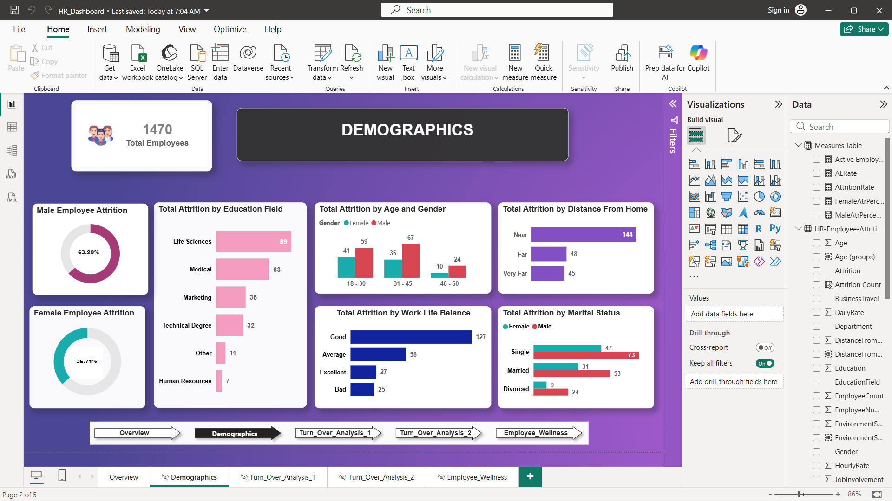

<div align="center">

# 📊 HR Attrition Analytics Dashboard

### Interactive Workforce Analytics and Employee Turnover Analysis using Microsoft Power BI

[](https://powerbi.microsoft.com/)
[](https://learn.microsoft.com/power-query/)
[](https://learn.microsoft.com/dax/)
[](https://www.microsoft.com/microsoft-365/excel)
[](https://github.com/Mousam098/HR-Attrition-Analytics-Dashboard)

<br>

[](https://github.com/Mousam098/HR-Attrition-Analytics-Dashboard)
[](https://mousom-os-portfolio.vercel.app)
[](https://www.linkedin.com/in/mousom-koley)

</div>

---

## 📌 Project Overview

The **HR Attrition Analytics Dashboard** is an interactive business intelligence project developed using **Microsoft Power BI** to analyze employee turnover and identify workforce segments associated with higher attrition.

Employee attrition directly affects organizational productivity, recruitment expenditure, workforce stability and long-term talent planning. However, raw HR data is often difficult to interpret without structured analysis and visual reporting.

This project transforms a publicly available HR dataset into a professional, multi-page Power BI dashboard. It enables HR teams and business stakeholders to explore attrition across employee demographics, job roles, departments, compensation, overtime, job satisfaction, work-life balance and career progression.

The dashboard converts complex employee records into clear, actionable and interactive workforce insights.

> **Data Privacy Notice:**
> This project uses a publicly available IBM HR Analytics sample dataset for educational, analytical and portfolio purposes. It does not contain confidential employee information from any real organization.

---

## 🖼️ Dashboard Preview

<div align="center">



</div>

> Place the dashboard screenshot inside the `assets` folder using the exact filename `hr-attrition-dashboard.png`.

---

## 🎯 Project Objective

The primary objective of this project is to analyze employee attrition and present meaningful HR insights through an interactive Power BI dashboard.

The project aims to:

* Measure the overall employee attrition rate
* Identify departments and job roles with higher employee turnover
* Analyze attrition across different age groups
* Examine the relationship between overtime and attrition
* Compare attrition based on gender, education and marital status
* Evaluate the influence of job satisfaction and environment satisfaction
* Understand the relationship between work-life balance and employee retention
* Analyze employee income, experience and career progression
* Support data-driven workforce planning and retention strategies

---

## ❓ Business Problem

Employee attrition is a critical workforce-management challenge. When employees leave an organization, the company may experience:

* Increased recruitment and onboarding costs
* Loss of experienced employees
* Reduced productivity
* Knowledge-transfer gaps
* Additional workload for existing employees
* Disruption in team performance
* Difficulty in long-term workforce planning

Traditional spreadsheets may contain large volumes of employee data, but they do not always provide an immediate understanding of the factors associated with employee turnover.

This project addresses the problem by creating a centralized and interactive analytical dashboard that helps users identify important workforce patterns and compare attrition across multiple employee dimensions.

---

## 💼 Business Questions Answered

The dashboard is designed to answer the following analytical questions:

1. What is the overall employee attrition rate?
2. Which age groups have the highest attrition?
3. Which departments experience greater employee turnover?
4. Which job roles are most affected by attrition?
5. Does overtime appear to be associated with higher attrition?
6. How does monthly income relate to employee retention?
7. What is the relationship between job satisfaction and attrition?
8. How does environment satisfaction affect employee turnover?
9. Does work-life balance influence employee retention?
10. Which education fields experience higher attrition?
11. How does attrition vary by gender and marital status?
12. Are employees with shorter organizational tenure more likely to leave?
13. Which employee groups may require focused retention initiatives?

---

## 📊 Dataset Overview

The project uses the publicly available **IBM HR Analytics Employee Attrition and Performance dataset**.

| Dataset Property         | Details                            |
| ------------------------ | ---------------------------------- |
| Total Employee Records   | 1,470                              |
| Total Attributes         | 38                                 |
| Target Variable          | Attrition                          |
| File Format              | CSV / Excel                        |
| Data Type                | Structured HR employee data        |
| Data Source              | Public HR analytics sample dataset |
| Project Usage            | Educational and portfolio analysis |
| Confidential Information | None                               |

The dataset contains employee demographic, professional, financial, satisfaction, performance and attrition-related information.

---

## 🧾 Dataset Features

### 👤 Employee Demographics

* Age
* Gender
* Marital Status
* Education
* Education Field

### 🏢 Employment Information

* Department
* Job Role
* Job Level
* Business Travel
* Distance From Home
* Employee Number
* Years at Company
* Years in Current Role
* Years With Current Manager

### 💰 Compensation Information

* Monthly Income
* Hourly Rate
* Daily Rate
* Monthly Rate
* Percent Salary Hike
* Stock Option Level

### 😊 Employee Experience

* Job Satisfaction
* Environment Satisfaction
* Relationship Satisfaction
* Job Involvement
* Work-Life Balance
* Training Times Last Year

### 📈 Career and Performance

* Performance Rating
* Total Working Years
* Years Since Last Promotion
* Num Companies Worked
* Overtime

### 🎯 Target Attribute

* Attrition

---

## 🛠️ Tools and Technologies

| Technology                     | Usage                                                        |
| ------------------------------ | ------------------------------------------------------------ |
| **Microsoft Power BI Desktop** | Dashboard design, data modelling and visualization           |
| **Power Query**                | Data cleaning, transformation and preparation                |
| **DAX**                        | KPI measures, calculated columns and analytical calculations |
| **Microsoft Excel**            | Initial dataset inspection and preprocessing                 |
| **CSV**                        | Raw employee dataset storage                                 |
| **GitHub**                     | Project documentation and version control                    |

---

## 🔄 Project Workflow

```mermaid
flowchart LR
    A[IBM HR Dataset] --> B[CSV / Excel]
    B --> C[Power BI Import]
    C --> D[Power Query Cleaning]
    D --> E[Data Transformation]
    E --> F[Data Modelling]
    F --> G[DAX Measures]
    G --> H[Dashboard Development]
    H --> I[Interactive Analysis]
    I --> J[HR Insights]
```



### Development Process

1. Collected the public HR employee attrition dataset
2. Examined the dataset structure and column definitions
3. Imported the dataset into Microsoft Power BI Desktop
4. Cleaned and transformed the data using Power Query
5. Verified data types and categorical values
6. Checked for missing values and duplicate records
7. Created calculated columns for analytical grouping
8. Developed DAX measures for HR KPIs
9. Designed multiple analytical dashboard pages
10. Added slicers, filters and visual interactions
11. Tested dashboard navigation and visual consistency
12. Interpreted findings from an HR and business perspective

---

## 🧹 Data Cleaning and Transformation

The following preprocessing activities were performed using Power Query:

* Verified column data types
* Checked for missing and null values
* Examined duplicate employee records
* Standardized categorical values
* Renamed fields for better readability
* Removed unnecessary fields from report visuals
* Created age-group categories
* Created employee attrition status categories
* Prepared income and experience-related fields
* Validated `Yes` and `No` values in the Attrition column
* Prepared the dataset for DAX calculations
* Optimized the data model for dashboard performance

---

## 🧮 DAX Measures

The dashboard uses DAX measures to calculate important HR metrics.

> Replace `HR_Dataset` with your actual Power BI table name when necessary.

### Total Employees

```DAX
Total Employees =
COUNTROWS('HR_Dataset')
```

### Attrition Count

```DAX
Attrition Count =
CALCULATE(
    COUNTROWS('HR_Dataset'),
    'HR_Dataset'[Attrition] = "Yes"
)
```

### Active Employees

```DAX
Active Employees =
CALCULATE(
    COUNTROWS('HR_Dataset'),
    'HR_Dataset'[Attrition] = "No"
)
```

### Attrition Rate

```DAX
Attrition Rate =
DIVIDE(
    [Attrition Count],
    [Total Employees],
    0
)
```

### Average Employee Age

```DAX
Average Employee Age =
AVERAGE('HR_Dataset'[Age])
```

### Average Monthly Income

```DAX
Average Monthly Income =
AVERAGE('HR_Dataset'[MonthlyIncome])
```

### Overtime Attrition

```DAX
Overtime Attrition =
CALCULATE(
    [Attrition Count],
    'HR_Dataset'[OverTime] = "Yes"
)
```

---

## 🖥️ Dashboard Architecture

The Power BI report is divided into five analytical pages.

### 1. Overview

The Overview page presents the primary HR performance indicators and provides a high-level summary of employee attrition.

It includes:

* Total Employees
* Active Employees
* Attrition Count
* Attrition Rate
* Average Employee Age
* Average Monthly Income
* Department-level attrition
* Overall workforce distribution

### 2. Demographics

The Demographics page analyzes attrition based on employee personal and educational characteristics.

It includes:

* Attrition by Age Group
* Attrition by Gender
* Attrition by Marital Status
* Attrition by Education
* Attrition by Education Field
* Employee demographic distribution

### 3. Turnover Analysis I

This page focuses on employee roles, departments and work-related characteristics.

It includes:

* Attrition by Department
* Attrition by Job Role
* Attrition by Job Level
* Attrition by Business Travel
* Attrition by Overtime
* Attrition by Distance From Home

### 4. Turnover Analysis II

This page provides deeper analysis of compensation, experience and career progression.

It includes:

* Attrition by Monthly Income
* Attrition by Total Working Years
* Attrition by Years at Company
* Attrition by Years in Current Role
* Attrition by Years Since Last Promotion
* Attrition by Number of Companies Worked

### 5. Employee Wellness

The Employee Wellness page examines workplace satisfaction and employee experience.

It includes:

* Job Satisfaction
* Environment Satisfaction
* Relationship Satisfaction
* Work-Life Balance
* Job Involvement
* Performance Rating
* Training Opportunities

---

## 📌 Key Performance Indicators

The dashboard presents several important HR KPIs:

| KPI                      | Description                                |
| ------------------------ | ------------------------------------------ |
| Total Employees          | Total number of employee records           |
| Active Employees         | Employees currently marked as non-attrited |
| Attrition Count          | Number of employees who left               |
| Attrition Rate           | Percentage of employees who left           |
| Average Age              | Average employee age                       |
| Average Monthly Income   | Average monthly employee income            |
| Overtime Attrition       | Attrition among overtime employees         |
| Average Years at Company | Average organizational tenure              |

---

## 🎛️ Interactive Features

The report includes interactive filters and slicers that allow users to analyze the data dynamically.

Available filters may include:

* Department
* Job Role
* Gender
* Age Group
* Education Field
* Marital Status
* Overtime
* Business Travel
* Job Level
* Attrition Status

When a user selects a filter, the connected visualizations update automatically to display the selected employee segment.

---

## 🔍 Key Analytical Insights

The dashboard can be used to identify patterns such as:

* Certain job roles may experience greater attrition than others
* Employees working overtime may show comparatively higher turnover
* Attrition may be concentrated within specific age groups
* Employees with lower job satisfaction may demonstrate higher attrition
* Employees with shorter organizational tenure may be more likely to leave
* Monthly income and job level may be associated with retention
* Work-life balance may influence employee stability
* Environment satisfaction may affect employee engagement
* Frequent business travel may be associated with higher turnover
* Specific departments may require targeted retention strategies

> These findings represent associations within the selected dataset. They should not be interpreted as confirmed causes of employee attrition.

---

## 🌍 Business Impact

The dashboard can support HR professionals and management teams in:

* Identifying workforce segments with higher attrition
* Developing targeted employee-retention strategies
* Monitoring department-level employee turnover
* Evaluating overtime and workload patterns
* Understanding employee satisfaction indicators
* Supporting compensation and career-development planning
* Improving workforce allocation
* Reducing avoidable replacement and recruitment costs
* Strengthening long-term workforce planning
* Supporting evidence-based HR decisions

---

## ⭐ Project Merits

The major strengths of this project include:

* Professional multi-page dashboard design
* Interactive data exploration
* Clear presentation of HR KPIs
* Centralized workforce analytics
* Dynamic filtering and cross-visual interaction
* Repeatable data-cleaning process using Power Query
* Business calculations using DAX
* Detailed demographic and turnover analysis
* Employee wellness and satisfaction analysis
* Management-friendly visual storytelling
* Scalable reporting structure
* Practical application of business intelligence in HR

---

## 🧠 Skills Demonstrated

This project demonstrates practical knowledge of:

* Microsoft Power BI
* Power Query
* DAX
* Data Cleaning
* Data Transformation
* Data Modelling
* KPI Development
* Dashboard Design
* HR Analytics
* Business Intelligence
* Data Visualization
* Data Storytelling
* Exploratory Data Analysis
* Business Problem Solving
* Git and GitHub
* Technical Documentation

---

## 📂 Repository Structure

```text
HR-Attrition-Analytics-Dashboard/
│
├── README.md
├── HR_Dashboard.pbix
├── HR_Employee_Attrition.csv
│
└── assets/
    └── hr-attrition-dashboard.png
```

---

## 🚀 How to Run the Project

### 1. Clone the Repository

```bash
git clone https://github.com/Mousam098/HR-Attrition-Analytics-Dashboard.git
```

### 2. Navigate to the Project Folder

```bash
cd HR-Attrition-Analytics-Dashboard
```

### 3. Open the Power BI File

Open the following file using Microsoft Power BI Desktop:

```text
HR_Dashboard.pbix
```

### 4. Update the Dataset Source

When Power BI cannot locate the dataset:

1. Open **Power BI Desktop**
2. Select **Home**
3. Select **Transform Data**
4. Open **Data Source Settings**
5. Select the existing source
6. Click **Change Source**
7. Browse to the dataset file inside the repository
8. Confirm the new file path
9. Select **Close & Apply**

### 5. Explore the Dashboard

Use the report navigation buttons, filters and slicers to explore:

* Overall attrition
* Employee demographics
* Department-level turnover
* Job-role attrition
* Overtime impact
* Compensation patterns
* Employee wellness
* Satisfaction indicators
* Career progression

---

## 🔮 Future Enhancements

The project can be enhanced through:

* Machine-learning-based attrition prediction
* Employee attrition risk scoring
* Department-specific prediction models
* Power BI Service deployment
* Scheduled data refresh
* Row-level security
* Drill-through employee analysis
* Historical attrition trend analysis
* What-if analysis for salary and overtime
* SQL database integration
* Cloud-based data integration
* Mobile-optimized report design
* Automated HR recommendations
* Employee retention simulation
* Real-time HR data connectivity

---

## ⚠️ Project Limitations

* The project uses a publicly available sample dataset
* The dataset does not represent a specific company
* The data contains a fixed number of employee records
* Historical time-series attrition data is not available
* The dashboard identifies patterns and associations, not confirmed causes
* Business decisions require additional organizational and qualitative context
* Results may vary when the dashboard is applied to another dataset

---

## ⚖️ Ethical Considerations

Employee analytics must be used responsibly.

This dashboard should support HR decision-making and should not be used as the sole basis for employment-related decisions.

Sensitive demographic attributes such as age, gender and marital status should not be used to discriminate against employees. Dashboard findings should be evaluated together with:

* Organizational policies
* Employee feedback
* Management judgment
* Legal requirements
* Fairness and privacy principles
* Appropriate human review

The purpose of this project is to improve workforce understanding, not to automate unfair employment decisions.

---

## ✅ Conclusion

The **HR Attrition Analytics Dashboard** demonstrates how Microsoft Power BI can transform raw employee data into meaningful and interactive workforce insights.

The project provides a structured analysis of employee turnover across demographics, job roles, departments, compensation, experience, overtime, satisfaction and employee wellness.

Through its five analytical pages, interactive filters, DAX measures and professional visual design, the dashboard enables users to explore employee attrition from multiple perspectives.

This project demonstrates practical skills in:

* Power BI dashboard development
* Power Query transformation
* DAX calculations
* Data modelling
* HR analytics
* Business intelligence
* Analytical storytelling
* Professional project documentation

---

## 👨‍💻 Author

<div align="center">

### Mousom Koley

**B.Tech in Information Technology**
**Data Analytics | AI/ML | Python Development**

[](https://github.com/Mousam098)
[](https://www.linkedin.com/in/mousom-koley)
[](https://mousom-os-portfolio.vercel.app)

</div>

---

## 📄 Disclaimer

This project was developed for educational, analytical and portfolio purposes.

The dataset is publicly available and does not contain confidential or personally identifiable employee information from any real organization. All dashboard findings are based exclusively on the sample dataset and should not be treated as universal conclusions about employee behaviour.

---

<div align="center">

### ⭐ If you found this project useful, consider giving the repository a star.

**Developed by [Mousom Koley](https://github.com/Mousam098)**

</div>
